# Countree User Manual

**English** | [Türkçe](manual.tr.md)

Countree is a single-page web app for dropping, counting and organising geo-points (for example trees) on a live satellite map. It runs entirely in your browser: there is no installation, no server and no account. The screenshots in this manual use the sample file `data/20260930-jupiter-ciftlik-03.csv` (9,622 trees in 13 areas).

## Contents

1. [Getting started](#1-getting-started)
2. [The screen at a glance](#2-the-screen-at-a-glance)
3. [Adding and managing points](#3-adding-and-managing-points)
4. [Areas (groups)](#4-areas-groups)
5. [Stats view and the group list](#5-stats-view-and-the-group-list)
6. [Close-points filter](#6-close-points-filter)
7. [Satellite providers and imagery date](#7-satellite-providers-and-imagery-date)
8. [Saving and loading CSV files](#8-saving-and-loading-csv-files)
9. [Keyboard shortcuts](#9-keyboard-shortcuts)
10. [Troubleshooting](#10-troubleshooting)

---

## 1. Getting started

1. Open `index.html` in a modern browser (double-click it, or run `open index.html`). An internet connection is required because the map library and satellite tiles are loaded online.
2. The map opens in **Add Mode**, ready for you to place points.
3. To start from existing data, click **Load CSV** and pick a file (see [section 8](#8-saving-and-loading-csv-files)).

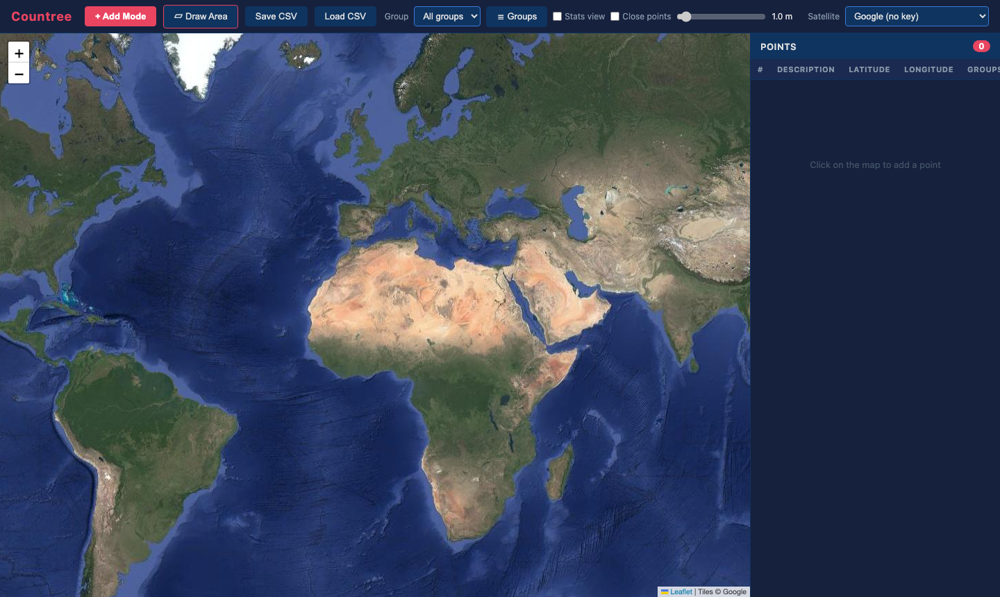

### API keys (optional)

The default providers, *Google (no key)* and *ESRI World Imagery (no key)*, need no setup. Mapbox, Google Maps API and HERE Maps need a key:

1. Copy `config.example.js` to `config.js`.
2. Fill in your key(s):

   ```js
   window.COUNTREE_CONFIG = {
     mapbox_key : 'pk.eyJ1IjoiYW...',
     google_key : 'AIzaSy...',
     here_key   : 'your-here-api-key',
   };
   ```

3. Reload the page and choose the provider from the **Satellite** dropdown.

`config.js` is git-ignored, so your keys stay on your machine.

## 2. The screen at a glance

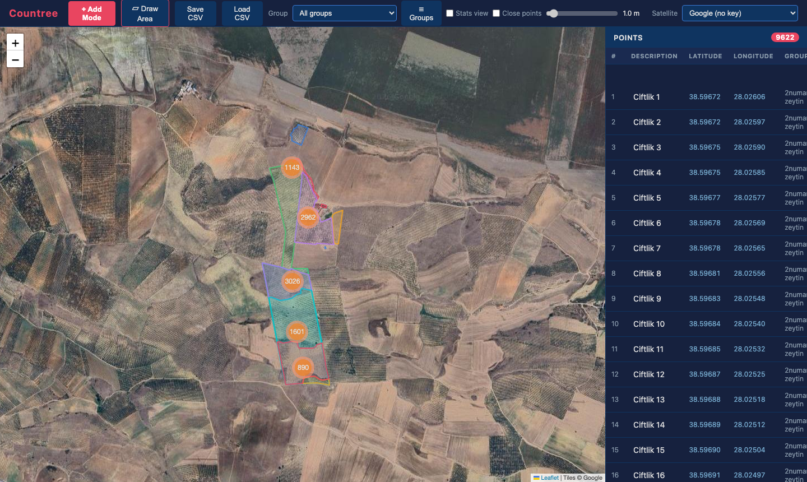

The window has three parts: the **toolbar** at the top, the **map** on the left and the **points table** on the right. Orange, yellow or green circles with a number are *clusters*: they merge nearby points so the map stays readable. Zoom in to split them into individual markers.

### Toolbar


| Control | What it does |
|---|---|
| **+ Add Mode / ✥ Pan Mode** | Toggles between placing points on click (Add) and just moving the map (Pan). |
| **▱ Draw Area** | Starts outlining an area (see [section 4](#4-areas-groups)). |
| **Save CSV** | Downloads all points and areas as `countree_points.csv`. |
| **Load CSV** | Replaces the current data with a CSV file. |
| **Group** dropdown | Shows only one group's points and highlights its area. |
| **☰ Groups** | Opens the group list with area, tree count and density. |
| **Stats view** | Replaces markers with one summary label per group. |
| **Close points** + slider | Shows only points that have a neighbour within the chosen distance. |
| **Satellite** dropdown | Selects the imagery provider. |

### Points table

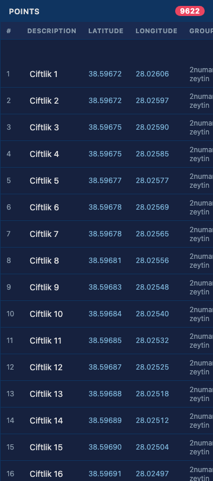

The right-hand table lists every point with its number, description, latitude, longitude and the groups it belongs to. The number next to **POINTS** is the total count (or `shown / total` while a filter is active). The table is virtualised, so even tens of thousands of rows scroll smoothly.

## 3. Adding and managing points

### Add a point

In **Add Mode** (the red button), click anywhere on the map. A marker is placed and a row is added to the table.

Names are generated automatically. The first point is `Point 1`; afterwards the name of the *last* point is used as a template and its trailing number is incremented. If your last point is `Tree 7`, the next one is `Tree 8`. To change the prefix, rename one point (for example to `Olive 1`) and the following points will continue as `Olive 2`, `Olive 3`, …

### Rename a point

Click the description in the table, type the new name and press **Enter** (or click elsewhere). An empty name is ignored.

### Inspect a point

Click a table row. The map zooms to the point (at least zoom level 14) and opens its popup with the name, coordinates and a delete button. You can also click a marker directly.

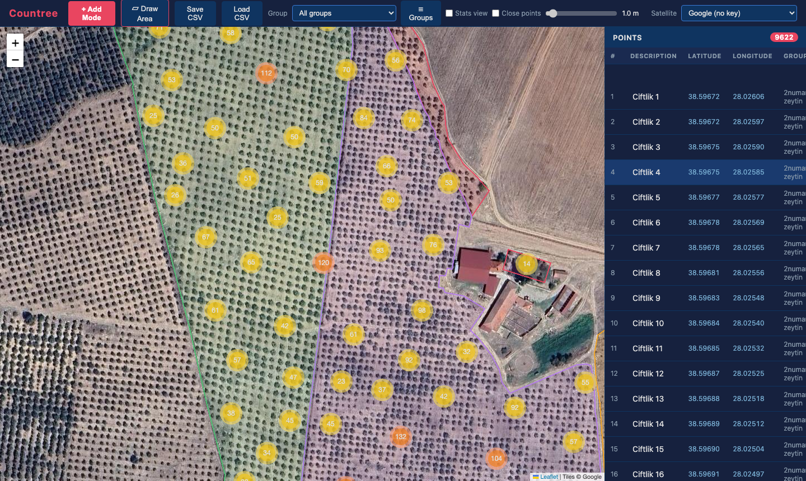

### Delete a point

Click the **✕** at the end of a table row, or click the marker and choose **Delete point** in the popup. Deletion is immediate and cannot be undone, so save a CSV first if you are unsure.

> **Tip:** switch to **Pan Mode** when you only want to move around, so you do not drop points by accident.

## 4. Areas (groups)

An *area* (also called a *group*) is a polygon that represents, for example, an orchard or a field. Every point inside the polygon automatically belongs to that group. A point can belong to several groups, and areas may overlap. Membership is **calculated from the polygon**, never stored, so it updates by itself when you move a corner or add points.

### Draw an area

1. Click **▱ Draw Area**. The button turns red.
2. Click on the map to place the corners. A dashed line follows your cursor.
3. After at least three corners, click the **first corner** (the large circle) to close the shape.
4. Type a name in the popup and press **Enter** or **Save**. **Cancel** or **Esc** discards the shape. If you leave the name empty, it is called `Group 1`, `Group 2`, …

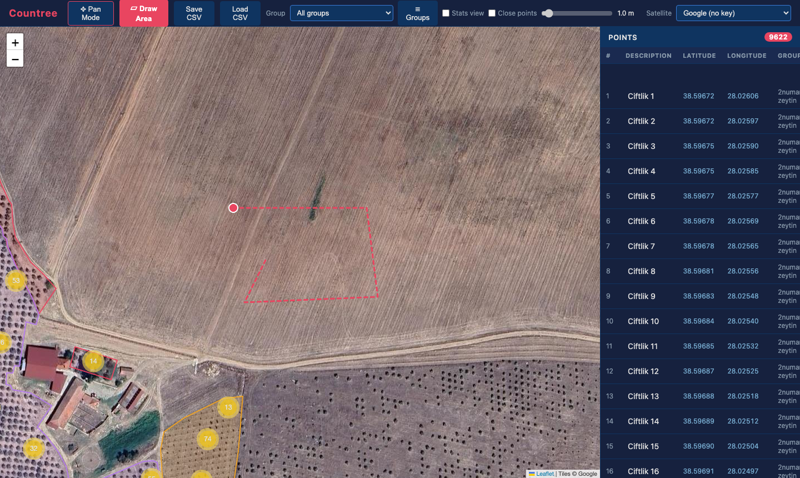

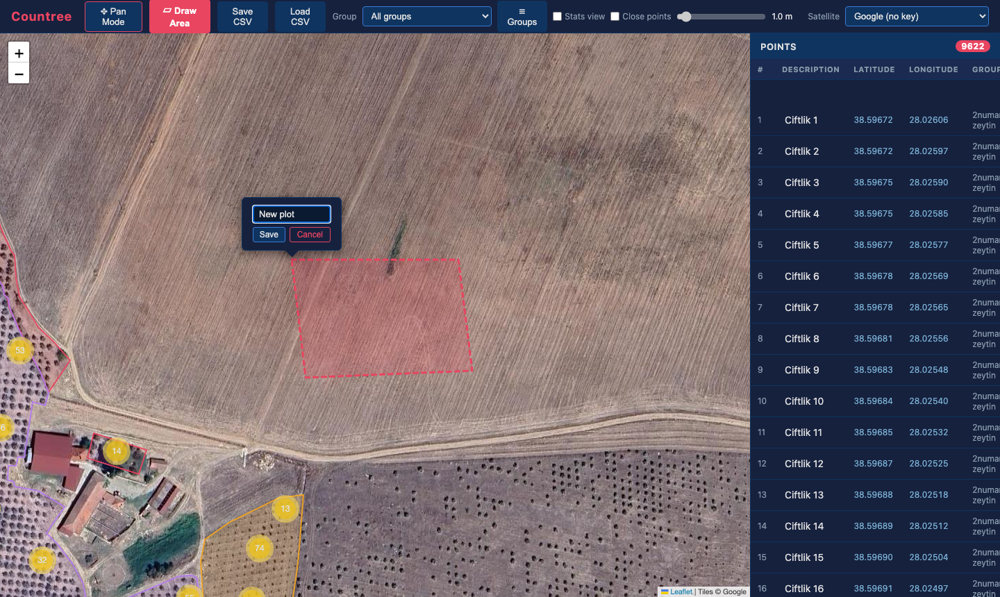

### Work with an existing area

Click an area in the map to open its popup.

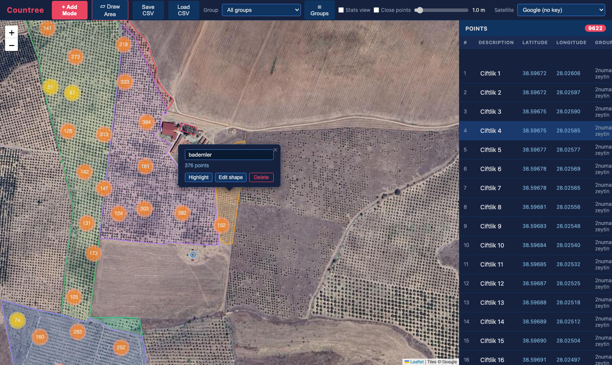

- **Name field** – edit the name and press Enter.
- **Highlight** – show only this group's points and fade the other areas. The button then reads **Show all**.
- **Edit shape** – drag the corner handles to reshape the area. Click **Done** or press **Esc** when finished.
- **Delete** – remove the area (the points stay).

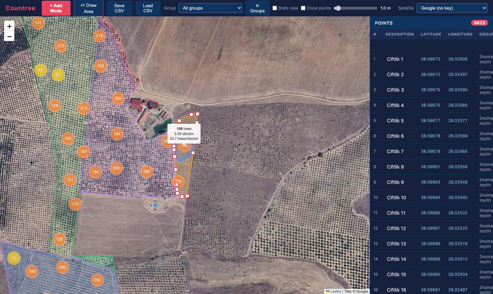

### Filter by group

Use the **Group** dropdown in the toolbar to select a group. The map zooms to it, its points are highlighted and the table lists only its members (`376 / 9622`). Choose **All groups** to go back.

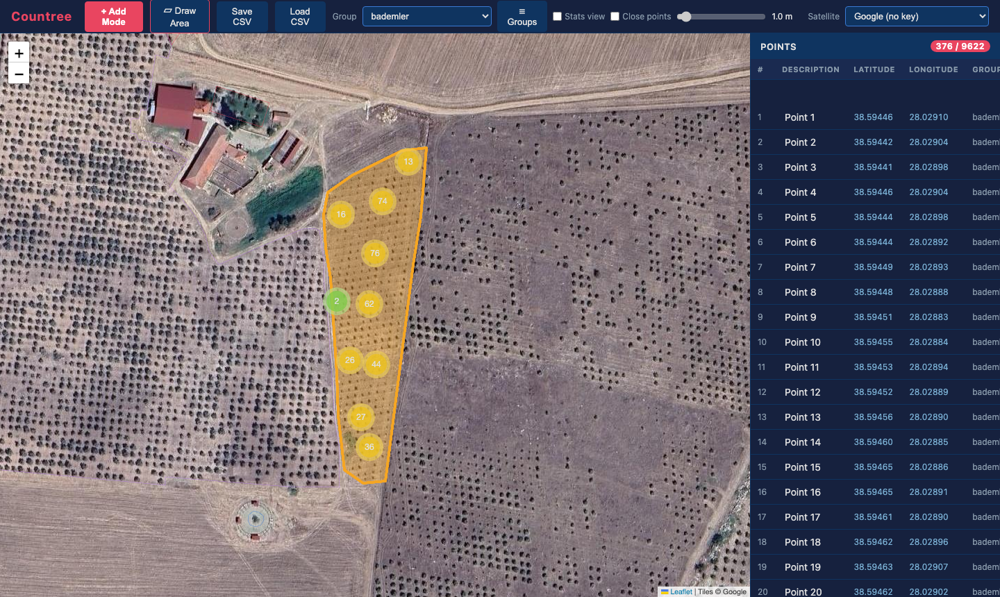

## 5. Stats view and the group list

### Group list

Click **☰ Groups** to open a table of all areas.

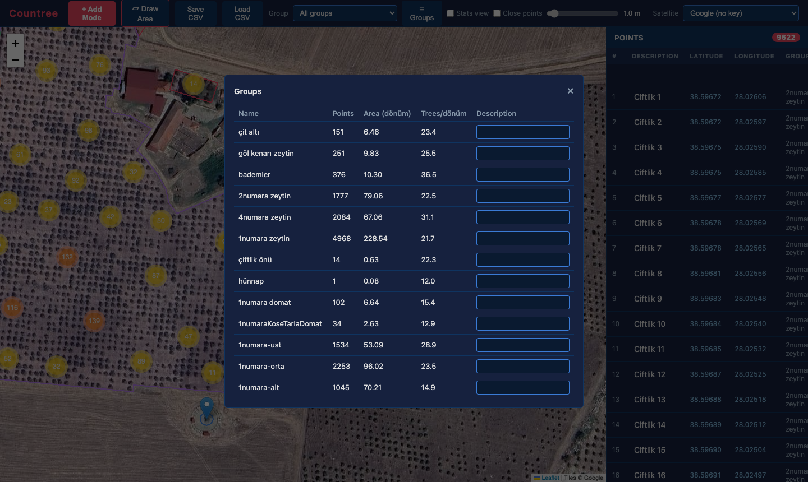

| Column | Meaning |
|---|---|
| Name | The group name. |
| Points | Number of points inside the area. |
| Area (dönüm) | Polygon area in dönüm (1 dönüm = 1,000 m²). |
| Trees/dönüm | Points divided by area: the planting density. |
| Description | A free-text note you can type for each group. It is saved in the CSV. |

Close the window with **×**, **Esc**, or by clicking outside it.

### Stats view

Tick **Stats view** to hide the individual markers and show one label per group with its tree count, area and density.

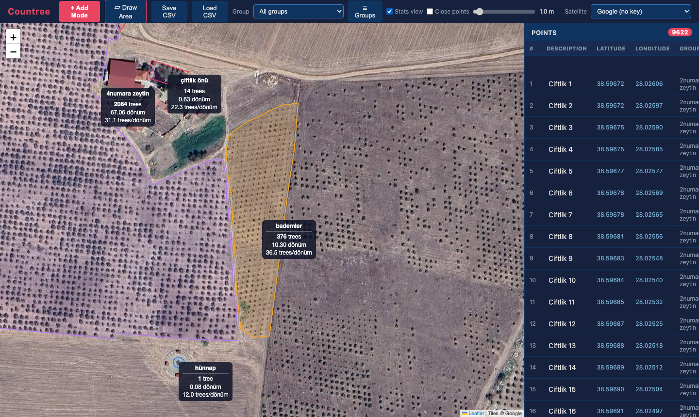

With Stats view **off**, you can still hover over a numbered cluster: a tooltip shows its point count, the area of the convex hull around its points, and the density.

## 6. Close-points filter

Use this to find duplicates or trees planted too close together.

1. Tick **Close points**.
2. Move the slider (0.1 – 20 m, default 1.0 m).
3. The map and table now show only points that have **another point within that distance**. The counter shows `shown / total`.

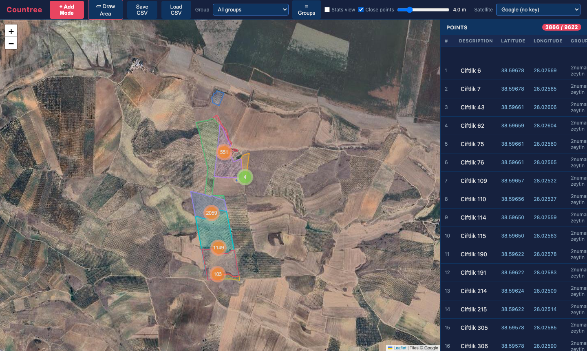

Combine it with the **Group** dropdown to check a single area. Untick the box to see everything again.

## 7. Satellite providers and imagery date

Pick a provider from the **Satellite** dropdown.

| Provider | Key needed | Notes |
|---|---|---|
| Google (no key) | No | Default; very detailed, unofficial source, no guarantees. |
| ESRI World Imagery (no key) | No | Shows an imagery-date badge. |
| Mapbox | Yes | [Get a token](https://account.mapbox.com/access-tokens/) |
| Google Maps API | Yes | [Enable Maps JavaScript API](https://console.cloud.google.com/apis/library/maps-backend.googleapis.com) |
| HERE Maps | Yes | [Get an API key](https://platform.here.com/portal/) |

If you pick a provider whose key is missing from `config.js`, a message tells you to add it and the map stays on the previous imagery. When the key is configured, the field next to the dropdown shows `(set in config.js)`.

### Imagery date

With ESRI selected, a badge in the bottom-right corner shows the approximate capture date of the imagery in the current view. It updates about a second after you stop moving the map. It reads **No date info** or **Unavailable** when ESRI has no data for that spot or cannot be reached.

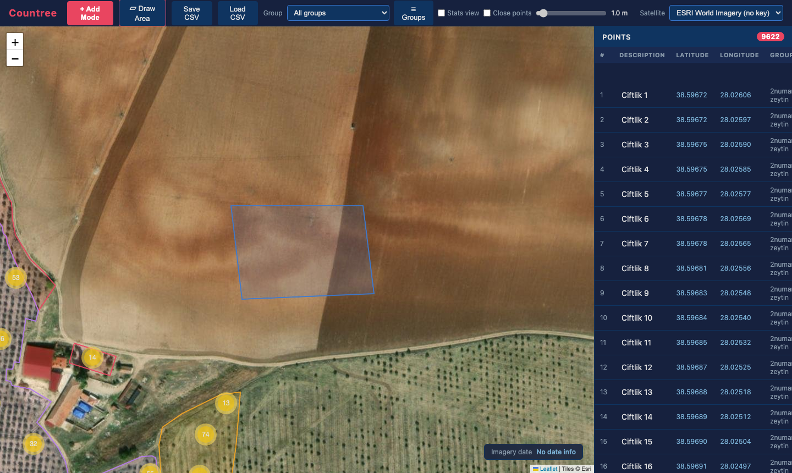

## 8. Saving and loading CSV files

### Save

Click **Save CSV**. The browser downloads `countree_points.csv` containing all points, all areas and the group descriptions. If there is nothing to save, a message says so. **Countree does not auto-save**: reloading the page loses unsaved work, so save regularly.

### Load

Click **Load CSV** and select a file. If data is already open you are asked to confirm, because loading **replaces** all current points and areas. Large files load in chunks so the browser stays responsive. When done, the map fits to the loaded data and a message reports the number of points and groups.

### File format

```csv
type,description,latitude,longitude,vertices,group_description
point,"Tree 1",41.01234,28.97654,,
point,"Tree 2",41.01100,28.97500,,
group,"North orchard",,,"41.02 28.97;41.02 28.98;41.01 28.98;41.01 28.97","Planted 2019"
```

- `point` rows use `description`, `latitude` and `longitude`.
- `group` rows use `description` as the group name and `vertices` as `latitude longitude` pairs separated by `;` (at least 3). `group_description` is the optional note.
- Text containing commas or quotes must be wrapped in double quotes; a quote inside is written as `""`.
- Older 3-column files (`description,latitude,longitude`) and files without `group_description` still load.
- Group membership is never stored in the file.

Typical errors: *Invalid header*, *Invalid row at line N*, *Invalid coordinates at line N*, *Invalid area at line N*. The line number points at the problem in the CSV.

## 9. Keyboard shortcuts

| Key | Action |
|---|---|
| **Esc** | Cancel the area being drawn, finish shape editing, close the group list or the name popup. |
| **Enter** | Confirm a renamed point, group name or new area name. |

## 10. Troubleshooting

| Problem | Solution |
|---|---|
| The map is grey or empty | Check your internet connection; tiles load online. Try another provider. |
| I selected Mapbox/Google API/HERE but nothing changed | The key is missing. Create `config.js` as described in [section 1](#api-keys-optional) and reload. |
| Points appear every time I click | You are in Add Mode. Click the **+ Add Mode** button so it reads **✥ Pan Mode**. |
| The table is empty but I loaded a file | A filter is active (Group or Close points). Choose **All groups** and untick **Close points**. |
| Imagery date says "No date info" | ESRI has no capture date for that location. Move or zoom the map. |
| My work disappeared after a reload | Countree does not auto-save. Use **Save CSV** before closing the tab. |
